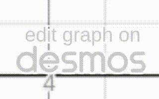

```{r, setup, include=FALSE}
library(webshot2)
knitr::opts_chunk$set(
  screenshot.opts = list(delay = 5)
)
warning = ""
```
```{r, echo=FALSE, eval=(knitr::pandoc_to("html"))}
warning = '<p>The graphs and diagrams created in <a href="https://www.desmos.com/calculator">desmos</a> are interactive just click on the <em>edit in desmos button</em> to open the desmos graph in a new tab.</p>'
```

# Welcome {-}
This course is designed to refresh your knowledge of maths to get you ready to use calculus in your course. There is no right or wrong way to use it. Each section includes written notes, a video (with the same content as the notes) and practice questions. It's chunked into bitesized sections to allow you make progress in 10 min windows. You may like to try the questions first and then just go back to the notes if you get stuck. Feel free to start anywhere you like.

`r warning`

This is a work in progress, the videos are appearing and things may change! If you find a mistake please email [edrs20@bath.ac.uk](mailto:edrs20@bath.ac.uk) and good luck!

:::{.content-visible unless-profile="default"}

## Subject specific

You're a busy person! So, with the help of your lecturer, I've tried to make this as relevant and concise as possible.

::::{.callout-warning title="Directly applicable"}

Whenever you see something in this box it will directly link the statistics covered in this resource to your course.

::::

:::

## What do tthe boxes mean?

:::{.callout-note title="Key point"}

Key points are summarised in boxes like this.

:::

:::{.callout-tip title="Answers and Mathematical notation"}

Notes on mathematical properties and answers to *Test yourself* quizes are in this colour boxes.

:::

:::{.callout-important title="Gotcha!"}

Sources of potential confusion are directly delt with in this box.

:::

## I'd love to hear from you

:::{.callout-tip}
## Let me know what you think

If you've got some spare time to [fill in this survey](https://bathreg.onlinesurveys.ac.uk/zero-to-hero) about this resource, I'd love to know what you think of it.
:::

Zero to Hero © 2026 by Ed Southwood, Skills Centre, University of Bath is licensed under [Attribution-NonCommercial-ShareAlike 4.0 International](https://creativecommons.org/licenses/by-nc-sa/4.0/).
